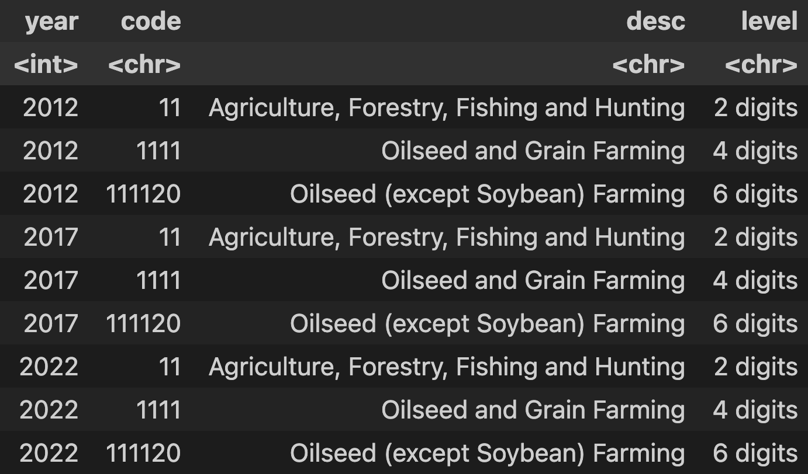
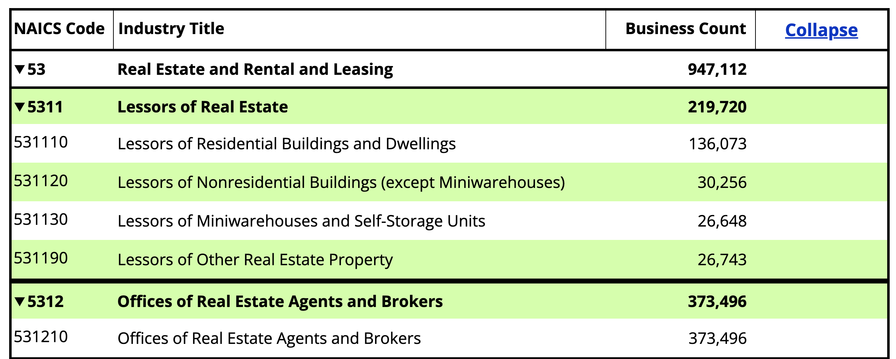

# A Simple Crawler for NAICS Code

## TL;DR

While NAICS (North American Industrial Classification System) data is public on its [own website](https://www.naics.com/search/) and [US Census's website ](https://www.census.gov/naics/?58967?yearbck=2022), utilizing it is tedious, as it's presented as an HTML page and users have to convert it into a 2D table. 

I wrote a simple [Scrapy](https://scrapy.org/) to collect all the NACIS classification results. (There're three versions of NAICS: 2012, 2017, and 2022).

To download, directly go the `results` folder and find the `naics_complete.feather` file.

## How to Read the Data?
`feather` is an amazing format provided by Apache that supports both R and Python without the need for convertion. 

If you use R (first install `arrow`):
```r
library(arrow)

df = read_feather('results/naics_complete.feather')
```

If you use Python (first install `pyarrow`):
```python
from pyarrow.feather import read_feather

df = read_feather('results/naics_complete.feather')
```

## How I Organize the Result


As you can see, there're four columns:

- `year`: 2012, 2017, or 2022

- `code`: the NAICS code

- `desc`: description of the industry

- `level`: 
    - `"2 digits"`: the highest level (about 20)

    - `"4 digits"`: the next level (about 300)

    - `"6 digits"`: the finest level (about 1000)


## How to Run the Crawler

At the root directory, simpy run `scrapy crawl naics`. Of course, you need to install Scarpy first. See its [documentation](https://scrapy.org/).

## Funny Facts about NAICS and WRDS

NAICS is one of the most popular, and to my personal view, the go-to industry classification systems for North America companies. Quoting WRDS:

> The three most popular industry classifications systems are SIC (Standard Industrial Classification), NAICS (North American Industrial Classification System), and GICS (Global Industry Classification Standard).

NAICS is designed to [replace](https://www.census.gov/naics/?99967) the old SIC system. It was developed jointly by the U.S. Economic Classification Policy Committee (ECPC), Statistics Canada, and Mexico's Instituto Nacional de Estadistica y Geografia.

Many databases in WRDS do offer NAICS code, but to my best knowledge, they **don't offer textual description**. So what's the use of an NAICS code, say 5311, if nobody tells you that it means "Lessors of Real Estate?" To get this textual description, we have to go to NAICS's official website, which only shows the data in HTML, not a downloadable tabular spreadsheet:




**Check out [this research note](https://yuzhu.run/naics/) for more details.**